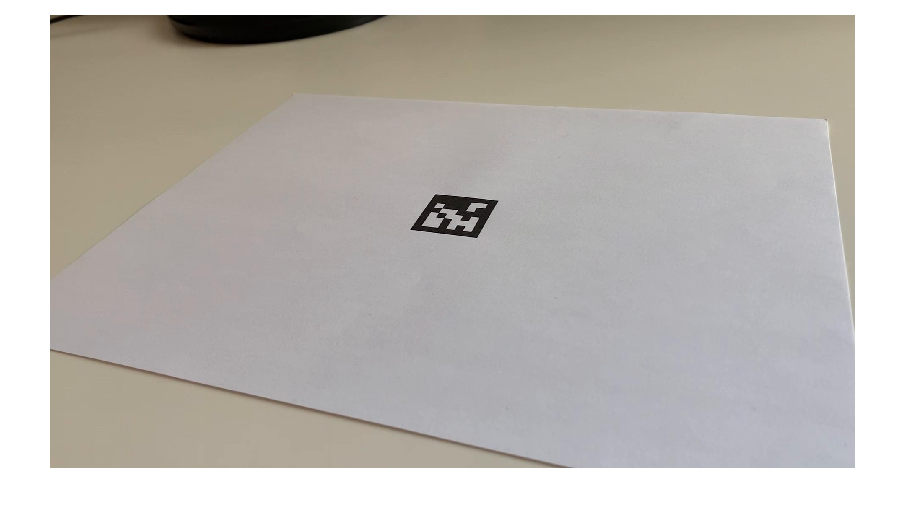
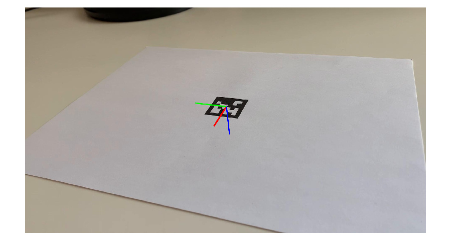
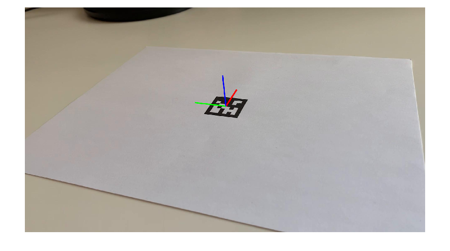
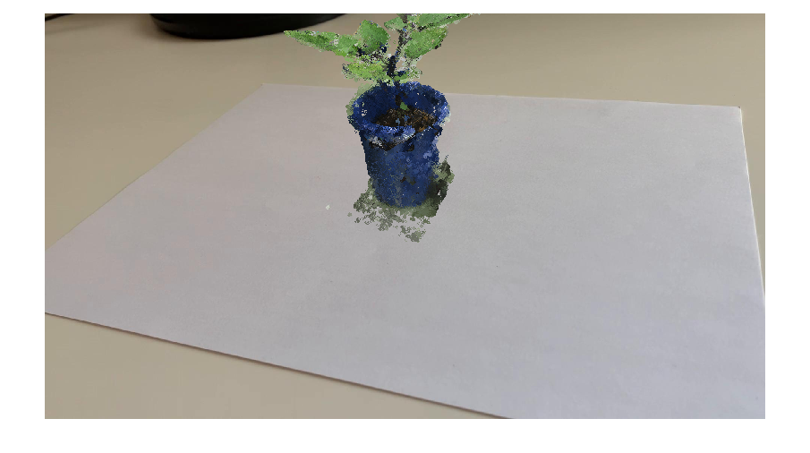
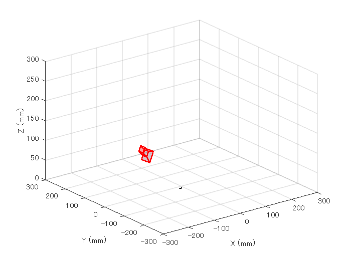
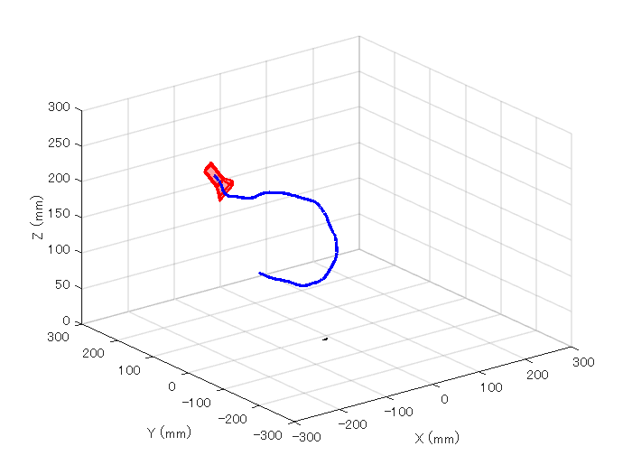
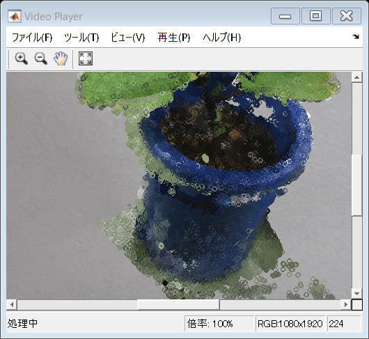

# Augmented Reality Using AprilTag Markers

This example shows how to render virtual content into a scene using an AprilTag. 

This script has been made based on the MATLAB official document as shown below. 

https://jp.mathworks.com/help/vision/ug/augmented-reality-using-apriltag-markers.html

# Parameter settings

```matlab:Code
clear;clc;close all
% Set it true if you would like render the eggplant point cloud 
isRenderPt = true;
%% if two outputs are placed vertically, set it true. 
isDispVertically = false;
```

# Load Video 

Download the video file into a present working directory. Use downloadVideo function at the end of this script. 

```matlab:Code
videoFilename = downloadVideo(pwd);
```

Load the video to read the first frame.

```matlab:Code
reader = VideoReader(videoFilename);
I = readFrame(reader);
```

Display the first frame.

```matlab:Code
figure;imshow(I)
```



# Load Camera Intrinsics

Load the camera intrinsics. The intrinsic parameters can be estimated using the [Camera Calibrator](docid:vision_ug#btxr8c_-1) app.

```matlab:Code
data = load("arCameraCalibrationParameters.mat");
intrinsics = data.cameraParams.Intrinsics;
```

# Estimate AprilTag Pose

Specify the size of the AprilTag in millimeters to match the units used during camera calibration. 

```matlab:Code
tagSize = 27.7813; % in mm
```

Specify the AprilTag family. 

```matlab:Code
tagFamily = "tag36h11";
```

Estimate the AprilTag pose.

```matlab:Code
[~, ~, tagPose] = readAprilTag(I, tagFamily, intrinsics, tagSize);
```

The X, Y, and Z axes are represented by red, green, and blue lines, respectively.

```matlab:Code
annotatedImage = helperInsertXYZAxes(I, tagPose, intrinsics, tagSize);
figure
imshow(annotatedImage)
```



 

Apply a rotation to the estimated tag pose that rotates the y-axis by 180 degrees to flip the z-axis. 

```matlab:Code
rotationAngles = [0 180 0];
tform = rigidtform3d(rotationAngles, [0 0 0]);
updatedR = tagPose.R * tform.R;
tagPose = rigidtform3d(updatedR, tagPose.Translation);
```

Display the updated world coordinate axes. 

```matlab:Code
annotatedImage = helperInsertXYZAxes(I, tagPose, intrinsics, tagSize);
figure
imshow(annotatedImage)
```



# Define Virtual Content

Define a 3-D cuboid to project onto the top of the AprilTag. The cube is centered on the AprilTag and defined to have the same size as the tag. 

```matlab:Code
[cubeWidth, cubeHeight, cubeDepth] = deal(tagSize);

vertices = [ cubeWidth/2 -cubeHeight/2; 
             cubeWidth/2  cubeHeight/2;
            -cubeWidth/2  cubeHeight/2;
            -cubeWidth/2 -cubeHeight/2 ];

cuboidVertices = [vertices zeros(4,1);
                  vertices (cubeDepth)*ones(4,1)];

% Activate the code below to display the egg plant instead of the cube
if isRenderPt == true
    pt = pcread('nasu.ply');
    loc = pt.Location - mean(pt.Location);
    loc(:,3) = loc(:,3) - min(loc(:,3));
    colMap = squeeze(label2rgb(round(normalize(pt.Location(:,3),1,"range")*100)));
    cuboidVertices = loc*3;
end
```

# Add Virtual Content to Image

Use [`world2img`](docid:vision_ref#mw_69af89ba-6463-4387-a15c-7c8e1fa5579f) to project the virtual cuboid vertices into the image coordinate system. 

```matlab:Code
projectedVertices = world2img(cuboidVertices, tagPose, intrinsics);
```

Use [`insertShape`](docid:vision_ref#btppvxj-1) to augment the image with the virtual content.

```matlab:Code
figure;
if isRenderPt == false
    augmentedImage = insertShape(I, "projected-cuboid", projectedVertices, ...
    Color="green", LineWidth=6);
else
    augmentedImage = insertMarker(I, projectedVertices, "circle", "Color",pt.Color);
end
imshow(augmentedImage)
```



Implement world2img function from scratch. Use the first xyz value in the vertices. 

```matlab:Code
vertice1 = cuboidVertices(1,:);
% Convert world coordinate into camera coordinate
camCord = tagPose.R*vertice1'+tagPose.Translation';
% Define intrinsic parameters
intrinsicParameters = [intrinsics.FocalLength(1),intrinsics.Skew,intrinsics.PrincipalPoint(1), 0; ...
    0, intrinsics.FocalLength(2),intrinsics.PrincipalPoint(2), 0; ...
    0, 0, 1, 0];
% Convert camera coordinate into xy value in the image coordinate
temp = intrinsicParameters*[camCord;1];
% As the scale factor is not defined, normalize the temp value using 
imgCord = temp/temp(3);
disp('Confirm if the value is same as projectedVertices')
```

```text:Output
Confirm if the value is same as projectedVertices
```

```matlab:Code
imgCord
```

```text:Output
imgCord = 3x1 の single 列ベクトル    
1.0e+03 *

    1.0121
    0.5552
    0.0010

```

# Visualize Camera Pose in 3-D

Use the estimated AprilTag pose and camera intrinsics to create a 3-D virtual representation of the scene corresponding to the image shown above. 

```matlab:Code
figure;
ax = helperShowVirtualCuboid(cuboidVertices);
```

Next, use [`pose2extr`](docid:vision_ref#mw_4d90cc38-ac81-4889-930f-265305142218) to convert the tag pose to the camera extrinsics, which represent the camera orientation and location in world coordinates.

```matlab:Code
camExtrinsics = pose2extr(tagPose);
```

Finally, use [`plotCamera`](docid:vision_ref#bup3vo1-1) to visualize the camera in 3-D. 

```matlab:Code
hold on
cam = plotCamera(AbsolutePose=camExtrinsics, Size=15, Parent=ax);
```



# Add Virtual Content to Video and Visualize Camera Trajectory

Repeat the steps above on the remaining video frames. 

```matlab:Code
% Create a video player to display video content.
player = vision.VideoPlayer();

% Create an animated line to display camera trajectory.
camTrajectory = animatedline(ax, ...
    camExtrinsics.Translation(1),...
    camExtrinsics.Translation(2),...
    camExtrinsics.Translation(3),...
    Color="blue", ...
    LineWidth=2);

videoObj = VideoWriter('renderingDemo', 'Uncompressed AVI');
open(videoObj);

% Loop over remaining video frames.
while hasFrame(reader)

    % Read next video frame.
    I = readFrame(reader);

    % Estimate AprilTag pose.
    [~, ~, tagPose] = readAprilTag(I, tagFamily, intrinsics, tagSize);

    % Update the tag pose to have z-axis pointing out of the tag.
    tagPose = rigidtform3d(tagPose.A*tform.A);

    % Project cuboid vertices from the world to image.
    projectedVertices = world2img(cuboidVertices, tagPose, intrinsics);
    
    % Insert cuboid into video frame. 
    if isRenderPt == false
        augmentedImage = insertShape(I, "projected-cuboid", projectedVertices, ...
        Color="green", LineWidth=6);
    else
        augmentedImage = insertMarker(I, projectedVertices, "circle", "Color",pt.Color);
    end
    % Display the augmented video frame.
    player(augmentedImage)
    
    % Update the camera position in the virtual scene.
    camExtrinsics = pose2extr(tagPose);
    cam.AbsolutePose = camExtrinsics;

    % Update camera trajectory in the virtual scene.
    addpoints(camTrajectory, ...
        camExtrinsics.Translation(1),...
        camExtrinsics.Translation(2),...
        camExtrinsics.Translation(3));
    f = getframe(gcf);
    
    [h, w, ~] = size(f.cdata);
    if isDispVertically==true
        augmentedImage = imresize(augmentedImage,[nan, w]); 
        output = [f.cdata;augmentedImage];
    else
        augmentedImage = imresize(augmentedImage,[h, nan]);
        output = [f.cdata,augmentedImage];
    end
    writeVideo(videoObj,output);

    % Flush the graphics pipeline.
    drawnow limitrate
end
```





```matlab:Code
% close the video object 
close(videoObj);
% delete the video
delete(videoFilename)
```

```text:Output
警告: ファイルが見つからないかアクセスが許可されていません
```

# Supporting Functions
## helperInsertXYZAxes - Insert XYZ axes into an image

```matlab:Code
function J = helperInsertXYZAxes(I, pose, intrinsics, axisLength)

xyzWorld = [0 0 0; axisLength 0 0; 0 axisLength 0; 0 0 axisLength];
xyzImage = worldToImage(intrinsics, pose, xyzWorld);

J = insertShape(I,...
    "Line", [
    xyzImage(1,:) xyzImage(2,:)
    xyzImage(1,:) xyzImage(3,:)
    xyzImage(1,:) xyzImage(4,:)
    ], ...
    Color=["red";"green";"blue"],...
    LineWidth=7);
end
```

## helperShowVirtualCuboid - Display a cuboid in a 3-D plot

```matlab:Code
function ax = helperShowVirtualCuboid(cuboidVertices)

% Create an axes with predefined limits.
ax = axes(XLim=[-300 300], YLim=[-300 300], ZLim=[0 300],...
    XLimMode="manual", YLimMode="manual", ZLimMode="manual");
grid on

% Create a cuboid using patch. Define faces corresponding to
% sets of cuboid vertices.
faces = [1 2 3 4;
         5 6 7 8;
         2 6 7 3;
         1 4 8 5;
         1 2 6 5;
         3 4 8 7];

patch(Faces=faces, Vertices=cuboidVertices, FaceColor="green", FaceAlpha=0.3);

% Add axis labels.
xlabel("X (mm)")
ylabel("Y (mm)")
zlabel("Z (mm)")
view(3)
end
```

## downloadVideo - Download example video

```matlab:Code
function videoFilename = downloadVideo(downloadFolder)

url = "https://ssd.mathworks.com/supportfiles/vision/data/arAprilTag.zip";
zipFile = fullfile(downloadFolder,"arAprilTag.zip");

% Download video file.
if ~exist(zipFile, "file")
    websave(zipFile,url)
end

% Unzip video file.
videoFilename = fullfile(downloadFolder,"arAprilTag.avi");
if ~exist(videoFilename, "file")
    unzip(zipFile,downloadFolder);
end
end
```
